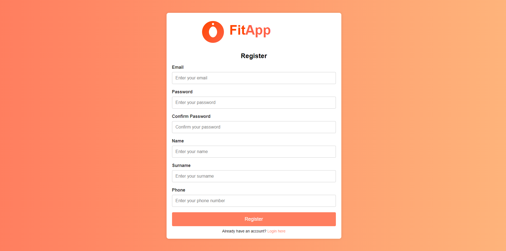
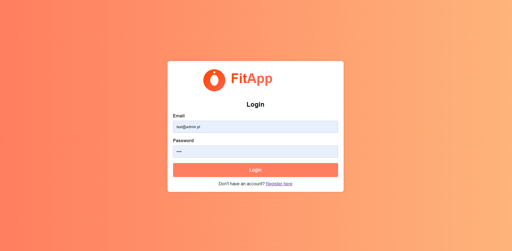
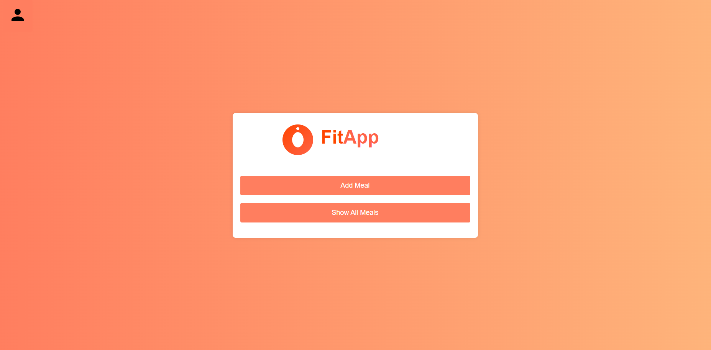
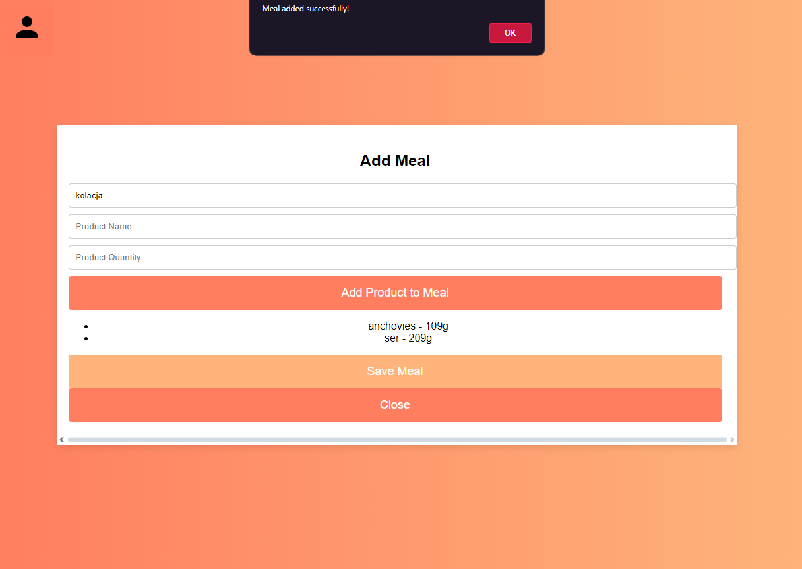
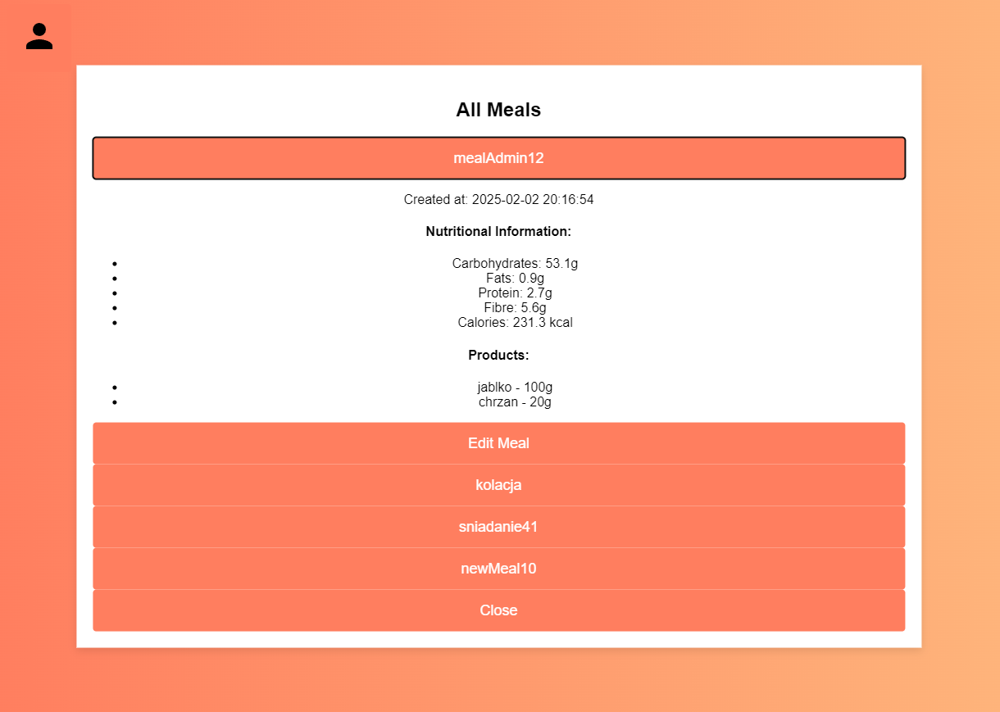
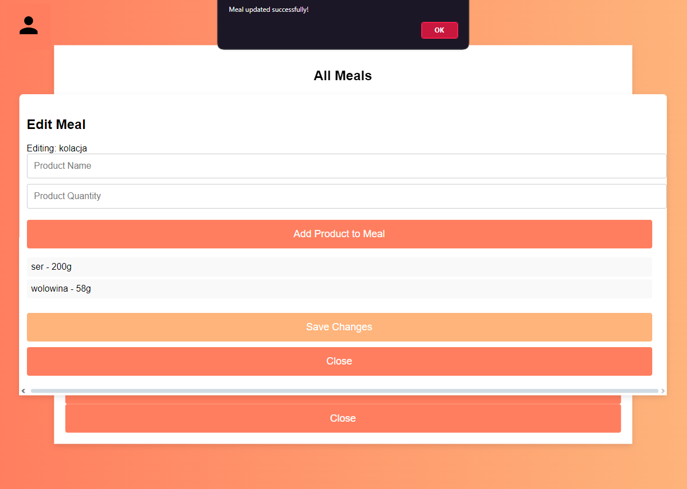
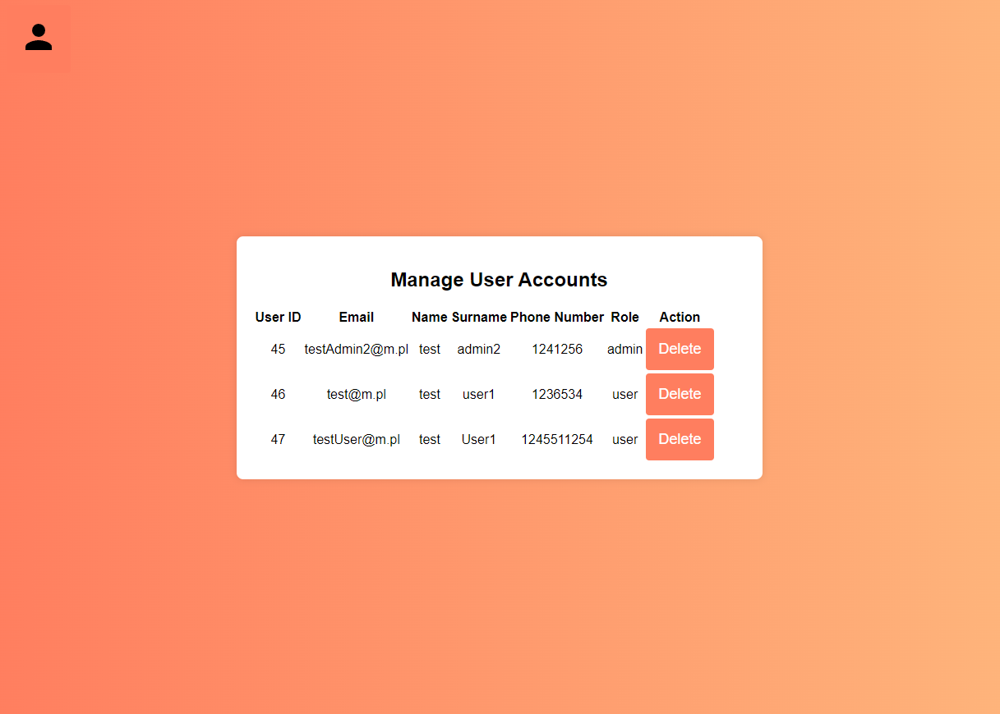
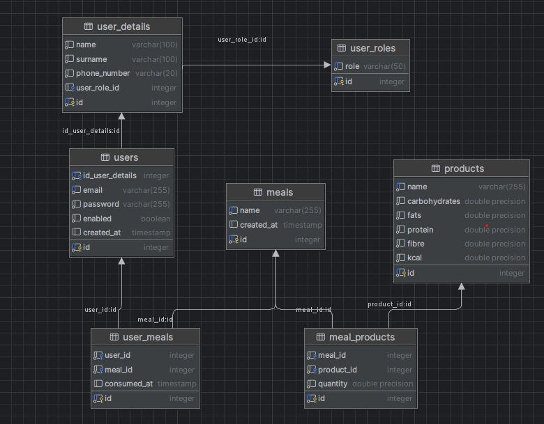

# Fit App
## About
#### Fit App is a tool dedicated for people who want to track their intake of calories and nutrients, all calculated automatically and summed up within each meal.

# App Overview

## Register

## Login

## Main Page

## Adding a meal

## Show all meals

## Edit an existing meal

## Admin panel (available only for user's of type 'admin')

## How to run
###### Clone repo
https://github.com/GabDev3/FitTracker

###### Build containers with docker command
docker-compose up -d

###### execute .sql files from database_dump directory
###### generate tables, then run insert statements in postgresql console

## Run app in your browser
### http://localhost:8080

# ERD Diagram
